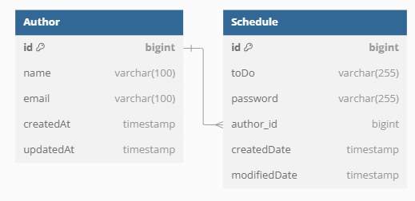

# SpringProject - Schedule

## 💻 프로젝트 소개
Spring을 이용한 일정 관리 애플리케이션입니다.

## ⏰ 개발 기간
* 24.12.04 ~ 24.12.09

## 📌 API 명세서

| Method   | URL                | Description | Request |
|----------|--------------------|-------------|---------|
| `POST`   | `/schedules`       | 일정 생성       | Body
| `GET`    | `/schedules`       | 일정 전체 조회    | Param
| `GET`    | `/schedules/{id}`  | 일정 단건 조회    | Param
| `PATCH`  | `/schedules/{id}`  | 일정 수정       | Body
| `DELETE` | `/schedules/{id}` | 일정 삭제       | Body

### 1. 일정 생성

| 필드명      | 필수 여부 | 데이터 타입      | 설명                       | 예시                     |
|-------------|-----------|-----------------|----------------------------|--------------------------|
| `toDo`      | ✅        | `String`        | 해야 할 일 (최대 200자)     | `"운동하기"`             |
| `name`      | ✅        | `String`        | 사용자 이름                 | `"Woojin"`             |
| `email`     | ✅        | `String`        | 유효한 이메일 형식          | `"woojin@example.com"`  |
| `password`  | ✅        | `String`        | 비밀번호                    | `"123456"`               |

### 2. 일정 전체 조회

| 필드명         | 필수 여부 | 데이터 타입        | 설명                              | 예시             |
|-------------|-----------|---------------|---------------------------------|----------------|
| `startDate` | ❌        | `String` (날짜) | 검색할 시작 날짜 (`yyyy-MM-dd`)        | `"2024-12-07"` |
| `endDate`   | ❌        | `String` (날짜) | 검색할 종료 날짜 (`yyyy-MM-dd`)        | `"2024-12-08"` |
| `period`    | ❌        | `String`      | 검색할 기간 ( 1hour, 1day, 1month 등) | `"1day"`         |
| `page`      | ❌        | `Integer`     | 페이지 번호 (기본값: 1)                 | `1`            |
| `size`      | ❌        | `Integer`     | 페이지 크기 (기본값: 5)                 | `5`            |

#### ※ 참고사항 : 기간을 설정할 때 startDate/endDate만 둘다 입력하거나, period 만 입력해야함

### 3. 일정 수정
| 필드명        | 필수 여부 | 데이터 타입   | 설명       | 예시       |
|------------|-----------|----------|----------|----------|
| `id`       | ✅        | `Long`   | 스케줄 ID   | `1`      |
| `password` | ✅        | `String` | 작성자 비밀번호 | `"123abc"` |

### 4. 일정 삭제
| 필드명 | 필수 여부 | 데이터 타입 | 설명      | 예시   |
|--------|-----------|------------|-----------|--------|
| `id`   | ✅        | `Long`     | 스케줄 ID | `1`    |
| `password` | ✅        | `String` | 작성자 비밀번호 | `"123abc"` |

## 📈 ERD 다이어그램

